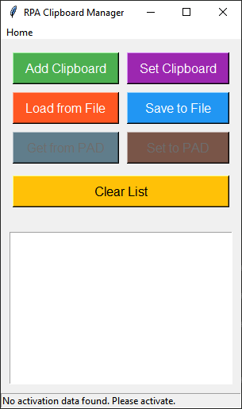

# RPA Clipboard Manager



The **RPA Clipboard Manager** is a simple yet powerful Python-based GUI application designed to help users manage and manipulate clipboard content. The application allows users to extract specific functions from the clipboard, save clipboard entries to a JSON file, load entries from a file, and easily set clipboard content from the application.

## Features

- **Add Clipboard**: Automatically extract and add functions from the clipboard to the application.
- **Set Clipboard**: Select and set any saved entry to the clipboard.
- **Load from File**: Load previously saved clipboard entries from a JSON file.
- **Save to File**: Save the current clipboard entries to a JSON file for later use.
- **Clear List**: Clear all entries in the list and the clipboard.

## Added Features (Pro Version)

- **Get Subflow Auto**: Copy clipboard subflows on Power Automate automaticly.
- **Set Subflow Auto**: Paste clipboard subflows to Power Automate automaticly.
- **Activate Key**: To request activated key, add LINE ID @127gyvgn

## Installation

### Prerequisites

- Python 3.x
- `pip` package installer

### Install Required Libraries

To run the application, you need to install the following libraries:

```bash
pip install pyautogui pygetwindow pillow pyperclip pyinstaller
```

To run application

```bash
python main.py
```

To build exe file

```bash
pyinstaller main.py --onefile --windowed
```
